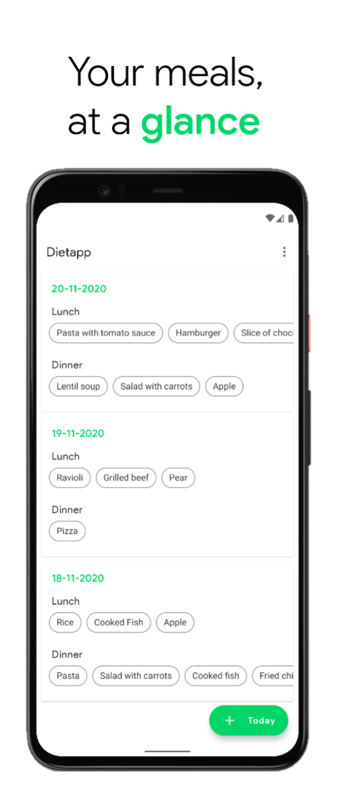
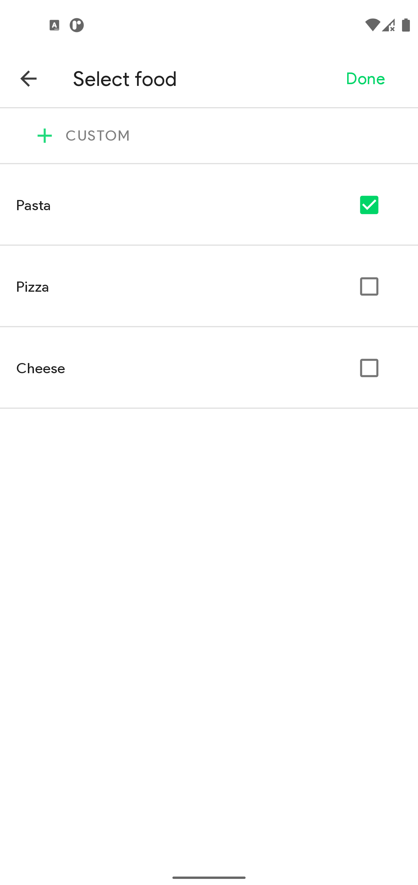
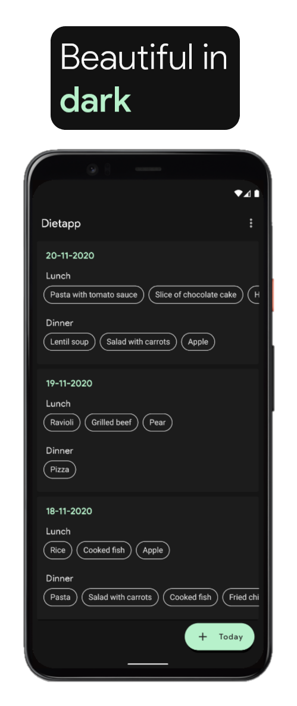
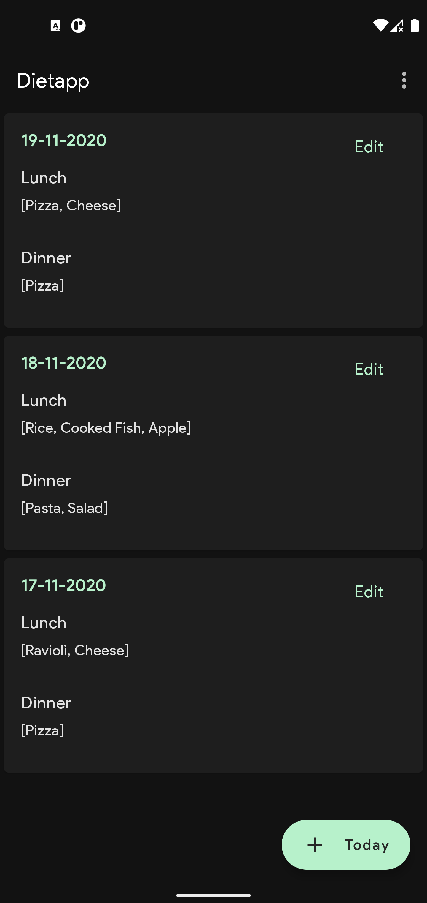
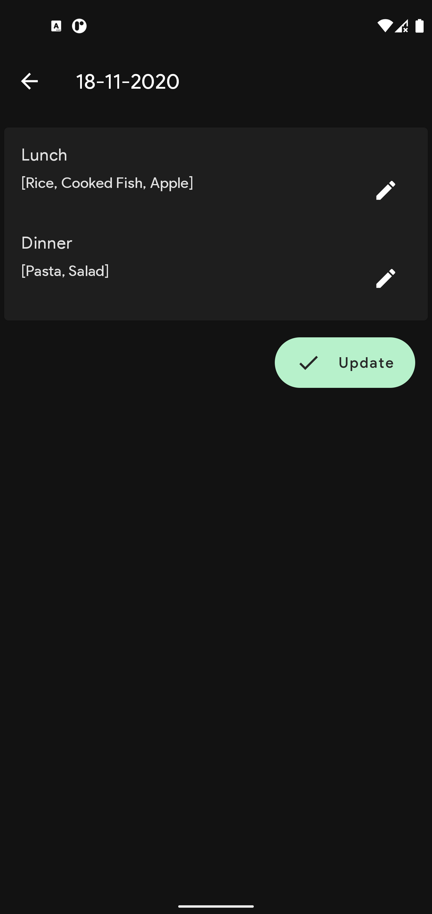

# Dietapp v 2.0
<p align="center">
  
</p>

## Supported Versions
From API 21 (Android 5.0 Marshmellow) up to API 30 (Android 11)

## Features
* Model View ViewModel (MVVM) paradigm
* Custom ```MutableLiveData``` implementation
* Native dark theme support
* Multi-language support (IT - EN)

---

<p float="center">
  
  
</p>

<p float="center">
  
  
</p>
